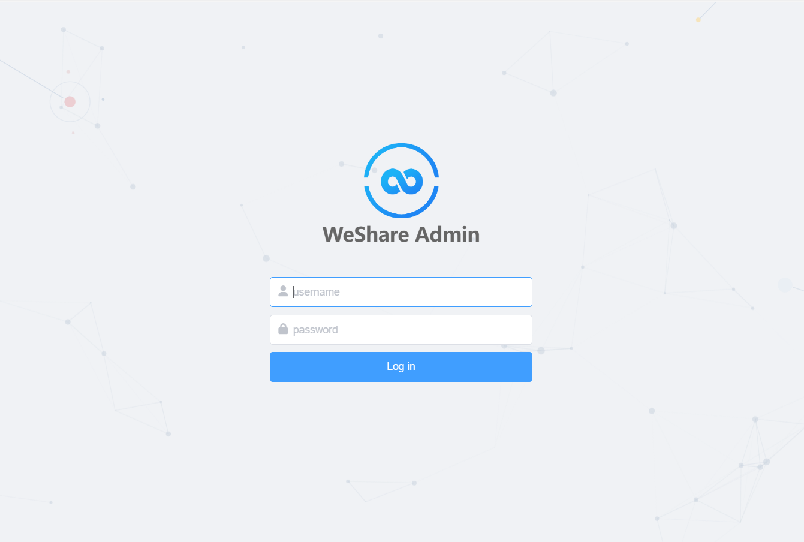
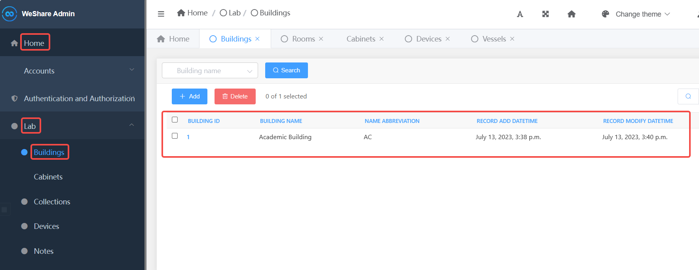
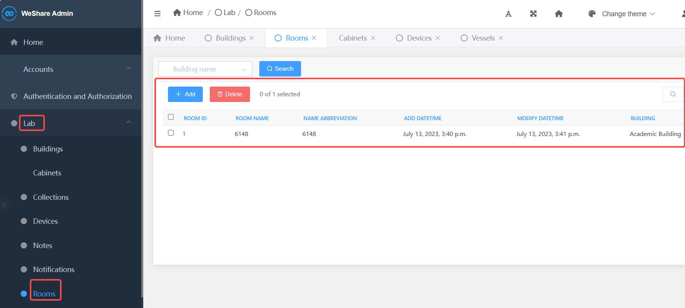
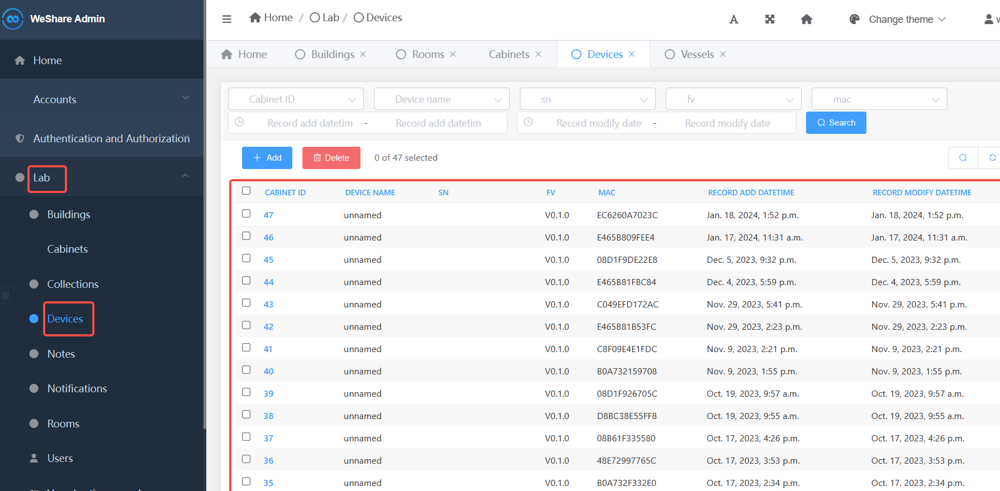
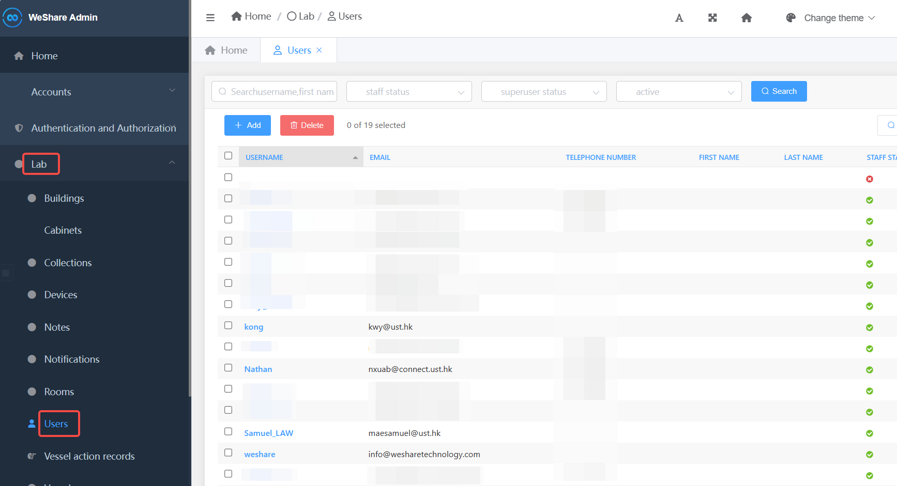

# 访问后台管理 Visiting Admin Manage Page

> 在浏览器中打开后台管理页面
> Open Admin Page in your browser

输入具有后台访问权限的**用户名和密码**，点击**Log in**即可登录
Enter your account name and password with backend access, and click **Log in** to log in.

登录验证成功后会跳转到如下的后台主页
After successful login verification, you will be redirected to the following backend home page.

## 基本页面布局

- A 左侧导航页面
- B 快速导航
- C 管理界面历史操作记录
- D 已打开的子页面切换
- E 字体/主题/用户管理

## 子页面布局

- A 数据展示与选择
- B 数据操作功能栏 (添加/删除/等二次开发功能)
- C 数据筛选栏 ()

### 建筑管理 Building

> 在左侧边栏中 点击 **Lab->Building** 进入到建筑管理页面

> In the left sidebar, click **Lab->Building** to go to the Building management page.

此页面用于管理建筑信息，可以进行以下操作

- **增加修改删除建筑记录**

### 房间管理 Rooms

> 在左侧边栏中 点击 **Lab->Rooms**进入到房间管理页面

> In the left sidebar, click **Lab->Rooms** to go to the Rooms management page.

此页面用于管理房间信息，可以进行以下操作

- **增加修改删除房间记录（分配房间到建筑）**

### 试剂柜管理 Cabinets

> 在左侧边栏中 点击 **Lab->Cabinets**进入到试剂柜管理页面

> In the left sidebar, click **Lab->Cabinets** to go to the Cabinets management page.

此页面用于管理试剂柜信息，可以进行以下操作

- **增加修改删除试剂柜记录（分配试剂柜到房间））**

### 设备管理 Device

> 在左侧边栏中 点击 **Lab->Devices** 进入到设备管理页面

> In the left sidebar, click **Lab->Device** to go to the Device management page.

此页面用于管理设备信息，可以进行以下操作

- **增加修改删除设备记录（分配容器到试剂柜）**

### 容器管理 Vessel

> 在左侧边栏中 点击 **Lab->Vessels**进入到容器管理页面

> In the left sidebar, click **Lab->Vessels** to go to the Vessel management page

此页面用于管理容器信息，可以进行以下操作

- **增加修改删除容器记录（分配容器到设备）**
- **导出容器记录**

### 用户管理 User Management

> 在左侧边栏中 点击 **Lab->Users** 进入到用户管理页面

> In the left sidebar, click **Lab->Users** to go to the user management page.
> 

此页面用于管理用户信息，可以进行以下操作

- **增加修改删除用户记录**

### 用户组 User Group
