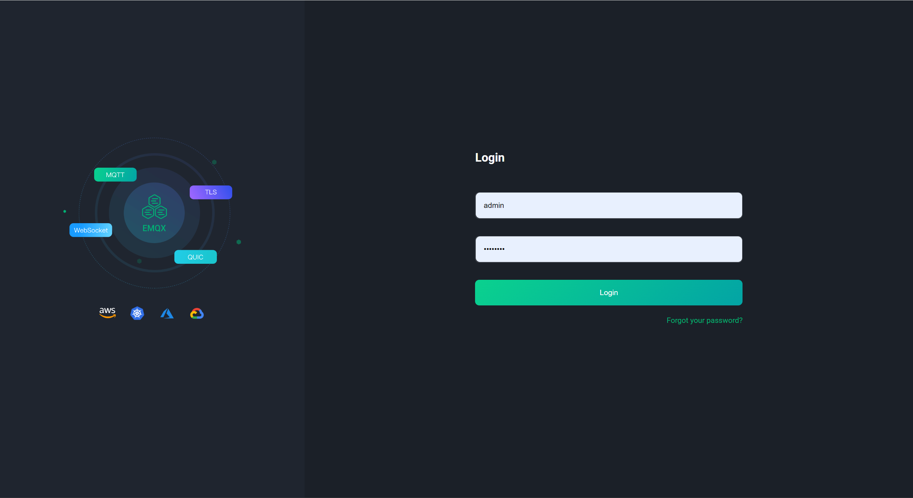

# 5.4 MQTT管理后台操作指南

## 5.4.1 访问 EMQX

1. **打开浏览器：** 使用任何常用的浏览器,如Chrome、Firefox、Edge等。

2. **输入地址：** 在浏览器的地址栏输入EMQX的访问地址,通常形式为`http://您的服务器地址:端口号`。例如,如果您在本地主机上运行EMQX,地址可能是`http://localhost:18083`。

3. **登录：** 页面加载后,您将看到EMQX的登录页面。输入EMQX的用户名和密码。通常,用户名为`admin`。

## 5.4.2 仪表盘概览

在成功登录后,您将被引导至EMQX的仪表盘。仪表盘提供了一个实时概览,显示了当前的连接数、消息流量、以及系统资源利用率等关键性能指标。

1. **连接数：** 显示当前已连接的客户端数量。
2. **消息数：** 显示在一定时间内通过EMQX传输的消息总数。
3. **节点信息：** 显示当前EMQX节点的状态信息,包括内存和CPU的使用情况。

## 5.4.3 客户端管理

在“客户端”标签下,您可以查看所有当前连接的客户端及其状态。

1. **查看客户端：** 列出所有连接的客户端,并显示它们的ID、IP地址、连接时间等信息。
2. **断开客户端：** 您可以选择任何客户端并断开其连接。

## 5.4.4 订阅管理

在“订阅”标签下,您可以管理客户端的订阅。

1. **查看订阅：** 显示所有活跃的订阅及其对应的客户端ID、主题、QoS等信息。
2. **删除订阅：** 您可以选择特定订阅并取消它。

## 5.4.5 主题监控

“主题”标签允许您监视和分析MQTT主题的活动。

1. **查看主题活动：** 列出所有主题及其相关的消息流量和订阅者数量。
2. **主题统计：** 提供特定主题的详细统计信息。

## 5.4.6 规则引擎

EMQX的规则引擎允许您根据消息内容或其他触发条件来执行自定义的业务逻辑。

1. **创建规则：** 定义新的规则,包括触发条件和动作。
2. **管理规则：** 查看、编辑或删除现有的规则。

## 5.4.7 用户与权限管理

在“用户”标签下,您可以管理访问EMQX的用户及其权限。

1. **添加用户：** 创建新的用户账户,并设置用户名和密码。
2. **设置权限：** 为用户定义特定的发布和订阅权限。
3. **用户列表：** 查看和管理现有用户。

## 5.4.8 系统设置

在“设置”区域,您可以配置EMQX的全局设置,包括日志、插件管理和其他系统参数。

1. **日志设置：** 配置日志文件的生成和保留规则。
2. **插件管理：** 启用或禁用EMQX的各种插件。
3. **系统参数：** 调整EMQX的系统参数以优化性能。

请确保在进行任何修改或配置更改后,详细记录并在必要时备份您的设置。
