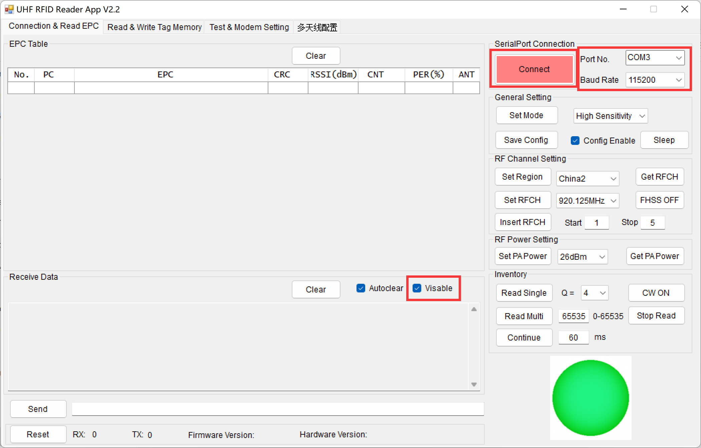

# 3.6 标签读写软件操作指南


## 3.6.1 安装驱动

1. **首次使用:** 设备第一次连接时, 需要安装USB驱动。Windows 7及以上系统会自动搜索并安装驱动。安装成功后, 可以在“计算机-系统属性-设备管理器-端口”中看到出现CP210X的端口, 表明安装成功。

2. **驱动异常处理:** 如果设备管理器中的驱动出现黄色感叹号, 表示驱动异常。此时, 可以使用驱动精灵等软件进行检测和安装。XP系统用户需要手动安装开发包中的USB驱动。

3. **确认安装:** 驱动文件通常包含在所提供的压缩包中, 按照提示操作安装即可。


## 3.6.2 驱动安装完成后的操作

1. **启动软件:** 安装完成后, 打开`RFID_Reader_Csharp`软件。

2. **连接串口:** 在端口号位置选择与设备管理器中相同的COM口, 并将波特率（Baud Rate）设置为115200, 然后点击“连接串口（Connect）”按钮（从红色的连接端口变为绿色的断开连接）, 无其他异常提示表明连接成功。



## 3.6.3 读取标签

1. **开始读取:**

    - **点击```Read Single```**,将读取一次标签.  
    - **点击```Read Mutiple```**,将读取(默认65525次)标签。

若场内有标签, 软件会显示读到的标签信息。成功状态下, 绿色的圆球状图标会亮起。


经读取器扫描到的标签信息会展示在EPC Table中。 

从左到右为: 
|No.|PC|EPC|CRC|RSSI(dBm)|CNT|PER(%)|ANT|
|---|---|---|---|---|---|---|---|
|序号| 传输控制协议位|标签EPC信息|校验位|信号强度|扫描次数|识别成功率|天线|

2. **轮询次数:** 读取操作会进行65535次轮询, 达到次数限制后, 读卡器会自动停止。若需再次读取, 点击“多标签识别”即可。

3. **停止识别:** 如需中止读取过程, 点击“停止识别”即可立即停止。

## 3.6.4 写数据操作


1. **单标签读取:** 在**Read & Write Tag Memory**界面, 点击**Read Single**, 屏幕会显示当前读取到的标签信息。

2. **选择标签:** 如果屏幕显示多个标签, 确保只有一张目标标签在天线范围内, 需要勾选**Select**以避免操作错误。
在左侧EPC Table中点击需要读写的标签，在右侧**Select Parameter**中设定**Set Select**

3. **数据写入:** 在界面中点击需要写入的标签EPC数据, 选择适当的访问区域, 设置起始地址和字长度, 然后在数据栏输入需要写入的16进制数据, 点击**Write**按钮完成写入。

4. **验证写入:** 如果写入成功, 底部状态栏会显示**Write Memory Success**。此时, 使用“单标签读取”可查看到更新后的标签数据。

注意:EPC区从02开始写入, 其他区（除TID外）从0开始。数据长度和起始地址应根据芯片容量适当设置。

