# 3.3 后端管理后台操作指南

## 3.3.1 页面布局

### 访问后台管理 Visiting Admin Manage Page

> 在浏览器中打开后台管理页面
> Open Admin Page in your browser

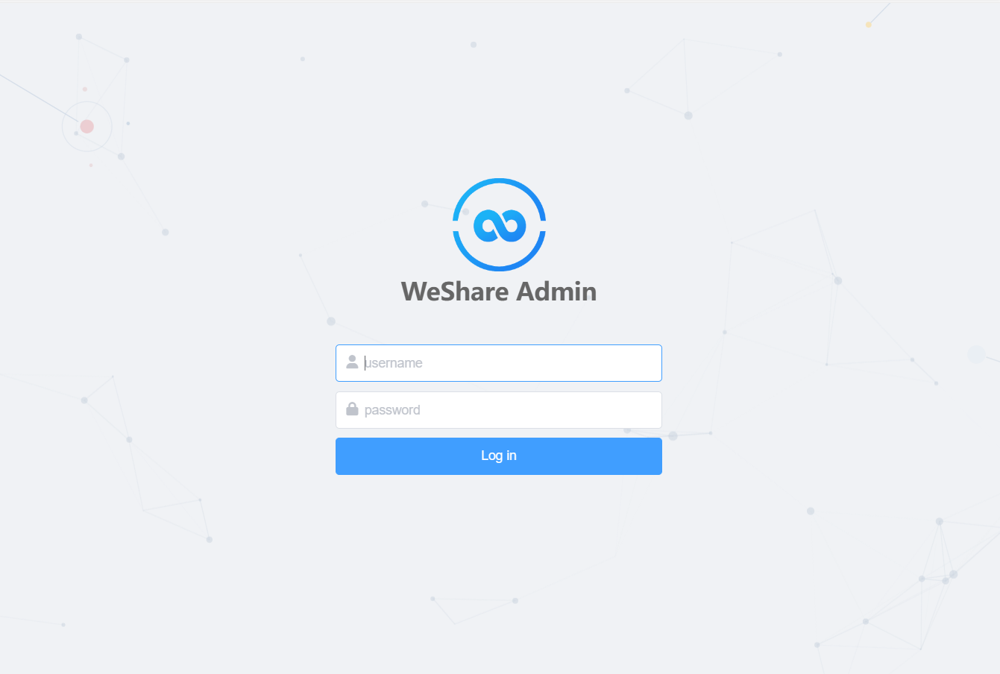

1. **输入具有后台访问权限的**用户名和密码**，点击**Log in**即可登录,
Enter your account name and password with backend access, and click **Log in** to log in.

2. **用户名和密码由 **`python app/manage.py createsuperuser`** 命令进行创建
本地运行的后端管理系统需要先运行 **`python app/manage.py runserver 0.0.0.0:8000`**
网页地址和端口号为 **`127.0.0.1:8000/admi`n

3. **登录验证成功后会跳转到如下的后台主页
After successful login verification, you will be redirected to the following backend home page.**

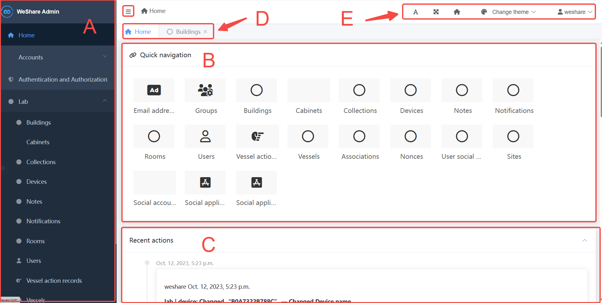

### 基本页面布局

- A 左侧导航页面
- B 快速导航
- C 管理界面历史操作记录
- D 已打开的子页面切换
- E 字体/主题/用户管理

### 子页面布局

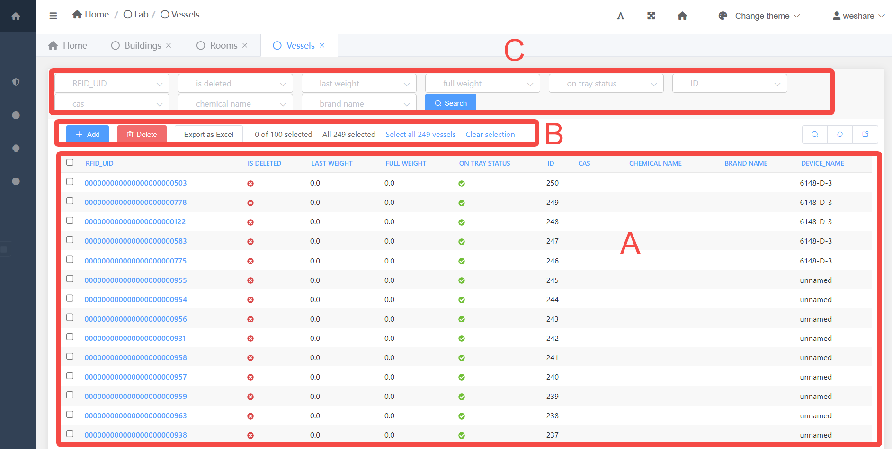

- A 数据展示与选择
- B 数据操作功能栏 (添加/删除/等二次开发功能)
- C 数据筛选栏 ()

#### 建筑管理 Building

> 在左侧边栏中 点击 **Lab->Building** 进入到建筑管理页面

> In the left sidebar, click **Lab->Building** to go to the Building management page.

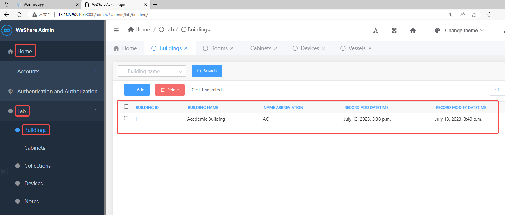

此页面用于管理建筑信息，可以进行以下操作

- **增加修改删除建筑记录**

#### 房间管理 Rooms

> 在左侧边栏中 点击 **Lab->Rooms**进入到房间管理页面

> In the left sidebar, click **Lab->Rooms** to go to the Rooms management page.

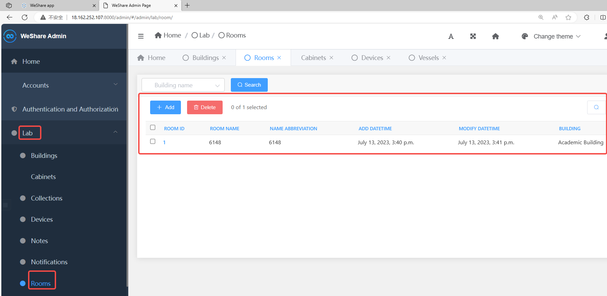

此页面用于管理房间信息，可以进行以下操作

- **增加修改删除房间记录（分配房间到建筑）**

#### 试剂柜管理 Cabinets

> 在左侧边栏中 点击 **Lab->Cabinets**进入到试剂柜管理页面

> In the left sidebar, click **Lab->Cabinets** to go to the Cabinets management page.

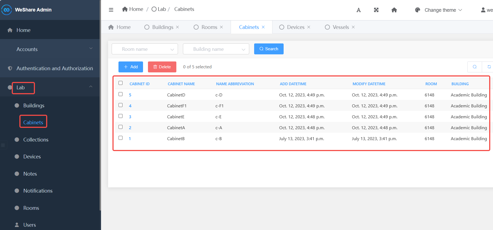

此页面用于管理试剂柜信息，可以进行以下操作

- **增加修改删除试剂柜记录（分配试剂柜到房间））**

#### 设备管理 Device

> 在左侧边栏中 点击 **Lab->Devices** 进入到设备管理页面

> In the left sidebar, click **Lab->Device** to go to the Device management page.

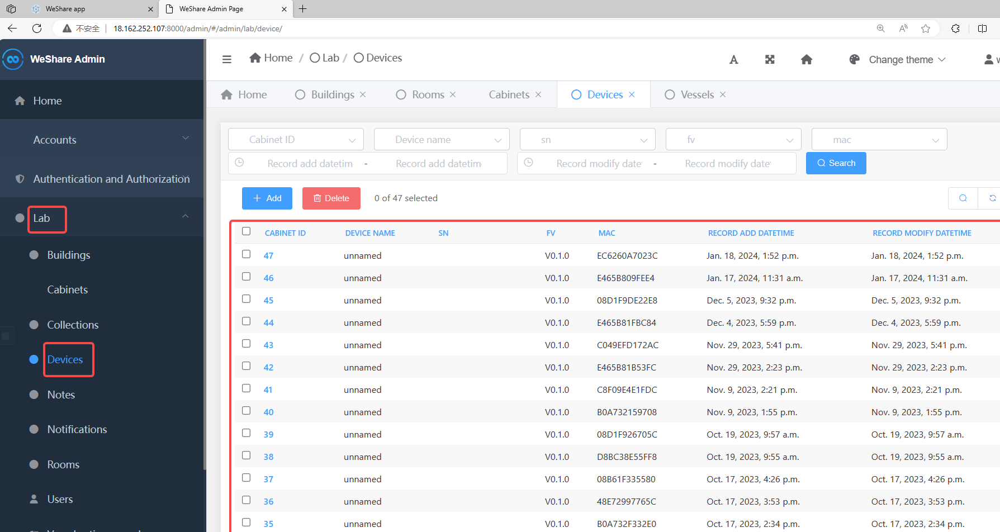

此页面用于管理设备信息，可以进行以下操作

- **增加修改删除设备记录（分配容器到试剂柜）**

#### 容器管理 Vessel

> 在左侧边栏中 点击 **Lab->Vessels**进入到容器管理页面

> In the left sidebar, click **Lab->Vessels** to go to the Vessel management page

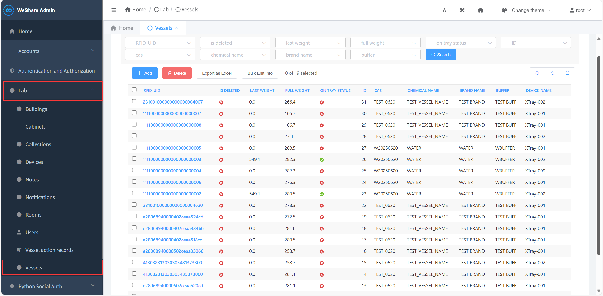

此页面用于管理容器信息，可以进行以下操作

- **增加修改删除容器记录（分配容器到设备）**
- **导出容器记录**
- **批量编辑容器信息**

#### 用户管理 User Management

> 在左侧边栏中 点击 **Lab->Users** 进入到用户管理页面

> In the left sidebar, click **Lab->Users** to go to the user management page.

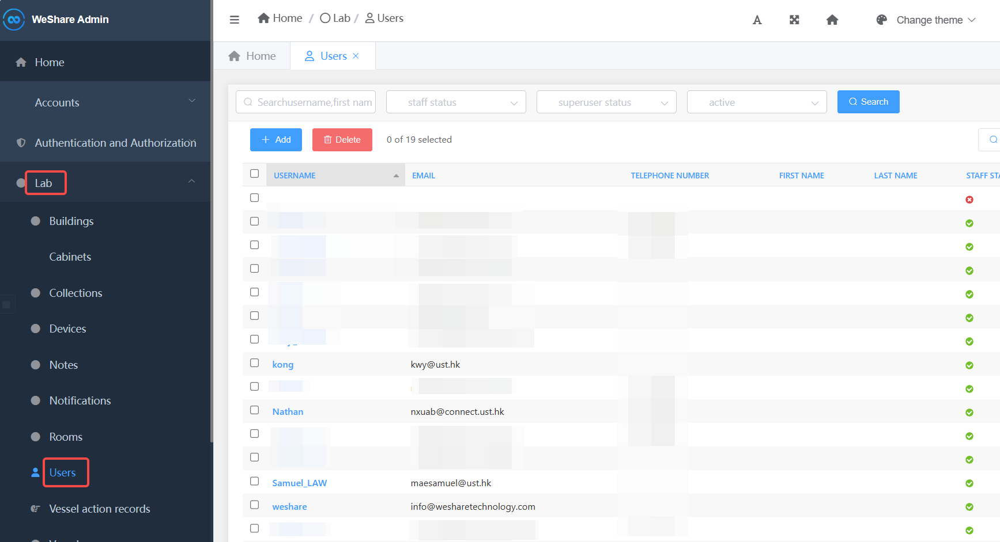

此页面用于管理用户信息，可以进行以下操作

- **增加修改删除用户记录**

#### 用户组 User Group

## 3.3.1 建筑注册

在**建筑管理**页面添加设备存放的**建筑信息**(若已有记录可跳过本步骤)

在 Building 页面的页面点击 **+Add**

**包含以下参数(图中黑色为必填项)**
|参数名|参数解释|是否必填|
|-----|------|-----|
|BuildingName|建筑名称|是，需手动填写|
|Name abbreviation|名称缩写|是，需手动填写|
|Date|记录添加日期|是，自动填充|
|Time|记录添加时间|是，自动填充|
|Add user|记录添加用户|是，需手动选择|
|Mod user|记录修改用户|是，需手动选择|

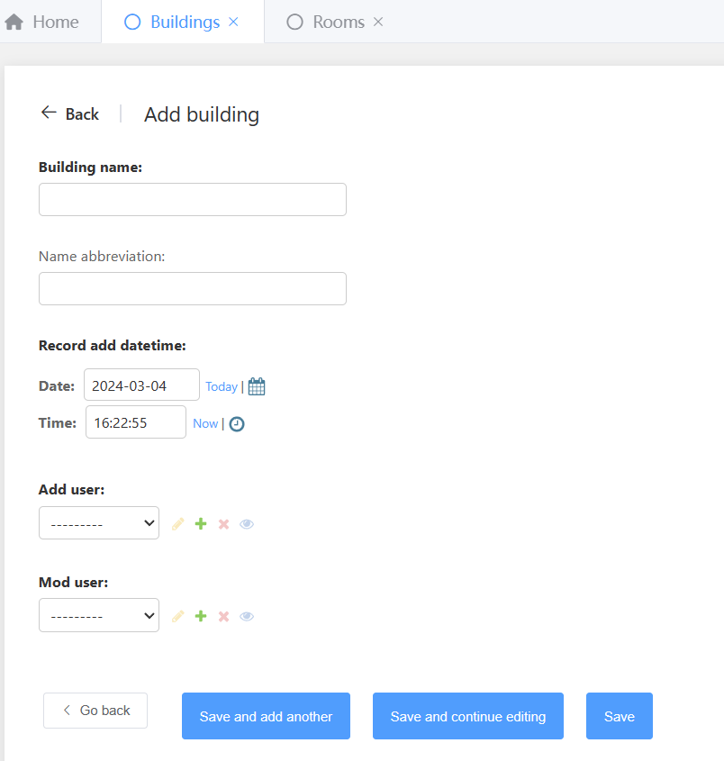

填写完成后可点击图示几个按键
Save and add another 保存并新加另一个，点击后会跳转至另一个新增页面
Save and continue editing 保存但不跳转
Save 保存

## 3.3.2 房间注册

在**房间管理**页面添加设备存放的**房间信息**(若已有记录可跳过本步骤)

在 Room 页面的页面点击 **+Add**

**包含以下参数(图中黑色为必填项)**
|参数名|参数解释|是否必填|
|-----|------|-----|
|Room Name|房间名称|是，需手动填写|
|Name abbreviation|名称缩写|是，需手动填写|
|Building|所在建筑缩写|是，需手动选择|
|Relative floor|房间所在楼层|是，需手动填写|
|Date|记录添加日期|是，自动填充|
|Time|记录添加时间|是，自动填充|
|Add user|记录添加用户|是，需手动选择|
|Mod user|记录修改用户|是，需手动选择|

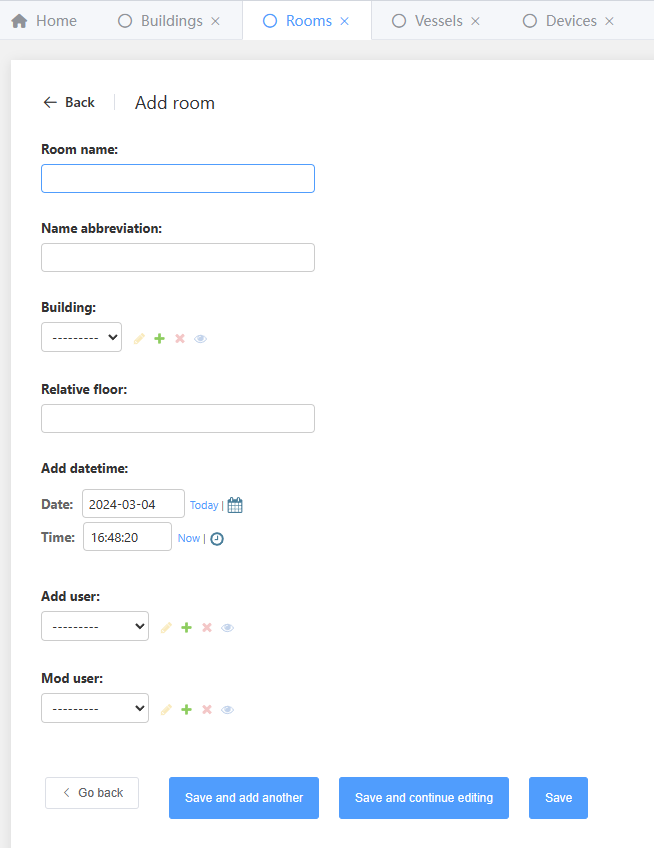

## 3.3.3 试剂柜注册

在**试剂柜管理**页面添加设备存放的**试剂柜信息**(若已有记录可跳过本步骤)

在 Cabinet 页面的页面点击 **+Add**

**包含以下参数(图中黑色为必填项)**
|参数名|参数解释|是否必填|
|-----|------|-----|
|Cabinet Name|房间名称|是，需手动填写|
|Name abbreviation|名称缩写|是，需手动填写|
|Building|所在建筑缩写|是，需手动选择|
|Room|所在房间缩写|是，需手动选择|
|Date|记录添加日期|是，自动填充|
|Time|记录添加时间|是，自动填充|
|Add user|记录添加用户|是，需手动选择|
|Mod user|记录修改用户|是，需手动选择|

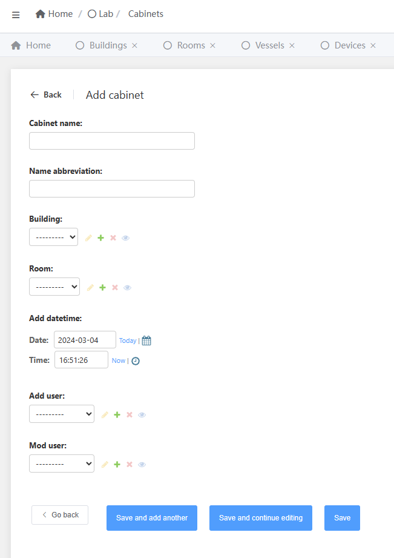

## 3.3.4 设备注册

设备注册存在两种方式

### 3.3.4.1 自动注册设备

1. 当设备配置正确 **(WIFI 信息,服务器地址,MQTT 账号密码,MQTT 消息通道)**
2. 接通电源后，打开设备电源开关，设备会自动连接网络。
3. 当网络连接成功后，进入测量阶段，此阶段会自动向服务器发送信息上报
4. 服务器会根据设备的**MAC/SN 信息**自动注册该设备
5. 但此时设备的位置等信息不完全，需要等待手动分配

### 3.3.3.3 手动注册设备

在设备管理页面添加设备存放的设备信息(若已有记录可跳过本步骤)

在**Devices**页面的页面点击 **+Add**

**包含以下参数(图中黑色为必填项)**
|参数名|参数解释|是否必填|
|-----|------|-----|
|Device Name|设备名称|是，需手动填写|
|sn|serial number 序列号|是，需手动填写|
|Fv|固件版本号|否|
|Mac|WIFI mac 地址|否|
|Cabinets|所在试剂柜|是，手动选择|
|Room|所在房间缩写|是，需手动选择|
|Building|所在建筑缩写|是，需手动选择|
|Date|记录添加日期|是，自动填充|
|Time|记录添加时间|是，自动填充|
|Add user|记录添加用户|是，需手动选择|
|Mod user|记录修改用户|是，需手动选择|

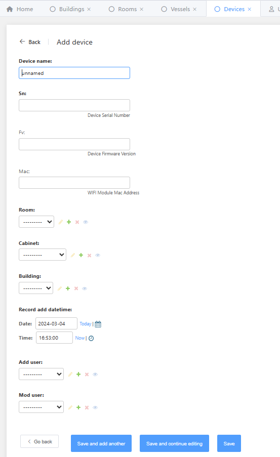

## 3.3.5 用户注册

Adding a new user

在用户管理界面中点击 Add 按钮添加新用户，其中黑色加粗的字段是必填项。

Click the **Add**button in the user management interface to add a new user, where the bolded black fields are required.

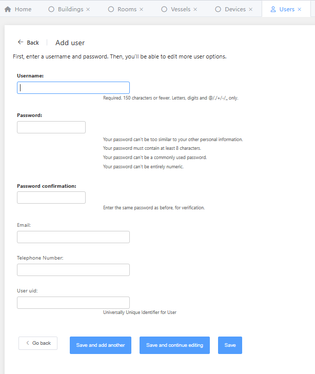

完成填写后，点击 save 即可保存基本信息。此时页面会自动跳转到用户配置，在这个页面里，你可以更改用户的密码，配置用户的登陆权限等高级操作

After finishing filling in the information, click **Save**to save the basic information. At this point, the page will automatically direct to the user configuration, in this page, you can change the user's password, configure the user's login privileges and other advanced operations

如果不想修改，可以点击左下角的 Go-back 按钮，页面会自动跳回到用户管理页面

If you don't want to change, you can click the**Go-back**button at the bottom left corner and the page will automatically direct back to the user management page

## 3.3.6 用户组管理

### 3.3.6.1 用户权限与分组 User authorization and grouping

在 4-2-2 中，非管理员（超级用户）用户不可以修改以下字段，仅有管理员可以对用户的权限进行修改，在这里，可以对用户能够访问的权限进行细致的修改

这里存在几个关键字段

Active 字段 用于停用或启用用户账号。

选中时，该用户可以通过鉴权系统验证密码获得系统的使用权， 留空时，该用户无法在任何页面登录。

Staff status 字段 用于授权用户是否能够登录后台管理页面。

选中时，该用户可以通过后台管理界面登录到后台，留空时，该用户无法访问后台管理界面，但是可以通过鉴权系统验证密码访问其他资源。

Superuser 字段 用于授权用户是否为超级用户，超级用户具有系统的所有权限，请谨慎授予该权限

In 4-2-2, non-administrator (superuser) users are not allowed to modify the following fields, and only administrators can make changes to the user's permissions, where the permissions that the user can access can be modified in detail

Several key fields exist here

Active field is used to deactivate or enable a user account.

When checked, the user can get access to the system by authenticating the password through the authentication system, when left empty, the user cannot log in from any page.

The Staff status field is used to authorize whether the user can log in to the backend administration page.

When checked, the user can log in to the backend through the backend management interface. When left blank, the user cannot access the backend management interface, but can access other resources through the authentication system with a password.

Superuser field is used to authorize whether the user is a superuser or not, the superuser has all the privileges of the system, please be careful to grant this privilege

## 3.3.7 容器管理 Vessel management

### 3.3.7.1 新容器的增加 Addition of new vessels

在容器管理界面中点击 Add 按钮添加新容器，其中黑色加粗的字段是必填项。完成填写后，点击 save 即可保存基本信息。

In the vessel management interface, click **Add**button to add a new vessel, where the black bolded fields are required. After completing the fields, click **Save**to save the basic information.

!

### 3.3.7.2 容器信息修改 Vessel information modification

如果需要修改容器的信息，你可以直接点击蓝色高亮的容器 ID，进入容器信息页面进行编辑

If you need to modify the vessel information, you can directly click on the blue highlighted container ID to enter the vessel information page for editing

!

下图是容器信息，你可以在页面上进行修改。修改完成后，下拉页面至最下面，点击 save 即可保存修改

The following figure shows the vessel information, you can modify it on the page. After you finish modifying, scroll down the page to the bottom and click **save**to save the changes

!

### 3.3.7.3 容器删除 Vessel Deletion

如果需要删除容器，你可以直接点击蓝色高亮的容器 ID，进入容器信息页面进行删除

If you need to delete the vessel, you can directly click on the blue highlighted tray ID and go to the tray information page to delete it

!

继续选择红色 Yes, I'm sure 按钮确认删除，灰色 No, take me back 按钮取消删除回到上一个界面

Continue to select the red**Yes, I'm sure** button to confirm deletion, and the gray**No, take me back** button to cancel deletion and return to the previous page

!
