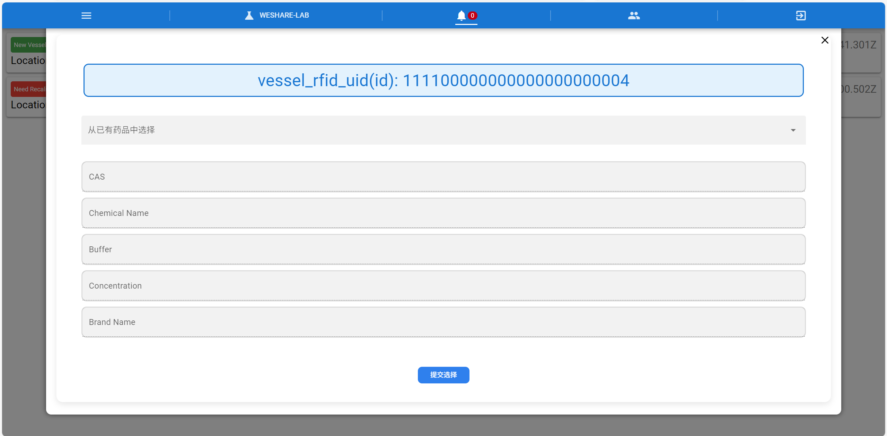

# 3.2 一般用户页面操作指南

## 3.2.1 用户注册 Registration

打开浏览器访问登录页面，点击 Register 标签页

输入用户名，密码和重复密码（确保两个密码一样），点击 REGISTER 注册

【根据提示修改用户名或者密码（可能因为密码安全性不够高被拒绝注册）】

注册成功后自动跳转进入主页

Open the browser to visit the login page, click Register tab to enter the user name, password and repeat password (make sure the two passwords are the same), click REGISTER to register [change the user name or password according to the prompts (may be rejected because the password security is not high enough)] after successful registration automatically jumped to the home page

## 3.2.2 用户登录 Login

打开浏览器访问登录页面，点击 Login 标签页

输入用户名，密码，点击 LOGIN

登录成功后自动跳转进入主页

Open your browser and visit the login page, click on the Login tab

Enter your username, password and click LOGIN

After successful login, you will be automatically redirected to the home page.

## 3.2.3 查看主页 View the homepage

> 在左侧边栏中 点击 Lab->WeShareLab 进入主页数据看板。

> In the left sidebar, click Lab->VesselListin to go to the homepage data dashboard.

## 3.2.4 查看容器信息 View vessel information

> 在左侧边栏中 点击 Lab->VesselList 进入到容器信息页面即可查看相应容器信息

> In the left sidebar, click Lab->VesselList to go to the vessel information page to view the vessel information.

## 3.2.5 查看设备信息 View Device imformation

> 在左侧边栏中 点击 Lab->Device 进入到托盘管理页面即可查看相应设备信息

> In the left sidebar, click Lab->Device to go to the tray management page to view the corresponding tray information.

## 3.2.6 查看通知 View notification

> 在顶部面包栏中 点击铃铛图标的 Notifications 进入到通知页面查看相应药品通知信息

> Click on the bell icon in the top navigation bar to access the Notifications page and view relevant medication alerts.

> 目前已有的通知类型有新增、重新校准。新增：当一个新的标签的药品放置在设备上时会发送一条类型为新增的通知，可以点击通知选择已有药品信息并提交。重新校准：当多个标签的药品同时放置在设备上时设备无法判断单个药品重量，需要重新将药品单独拿取后放置回设备上校准重量。

> Currently, there are two types of notifications: New Addition and Recalibration.New Addition: When a new medication label is placed on the device, a "New Addition" notification will be sent. You can click on the notification to choose in the medication information and submit it.Recalibration: When multiple medication labels are placed on the device simultaneously, the device may be unable to determine the weight of individual medications. You need to remove and replace each medication separately on the device to recalibrate the weights.

